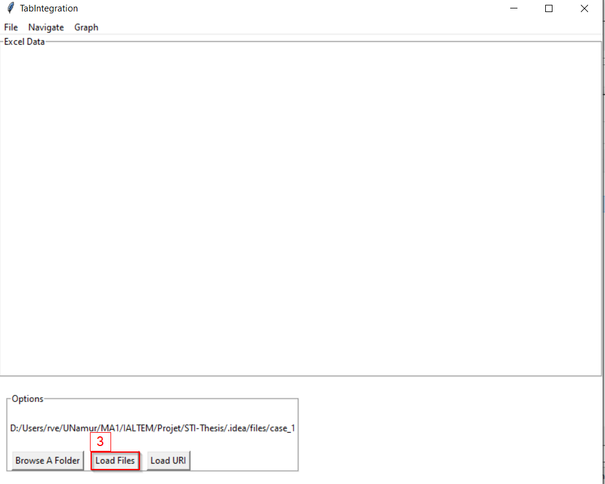
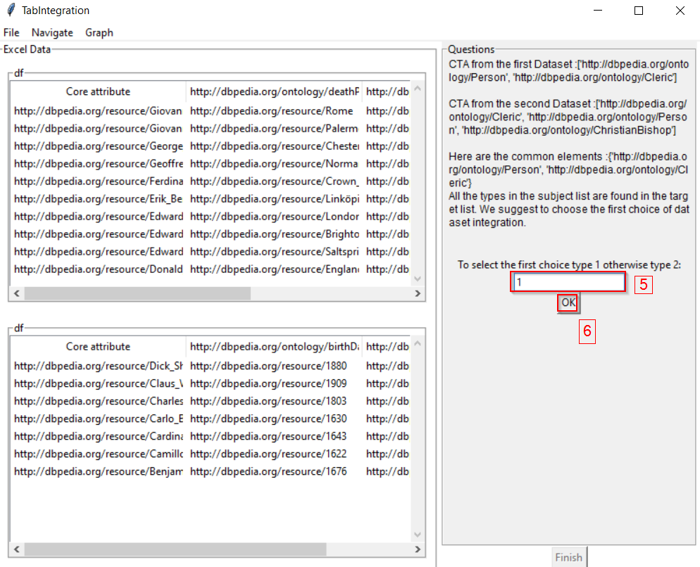
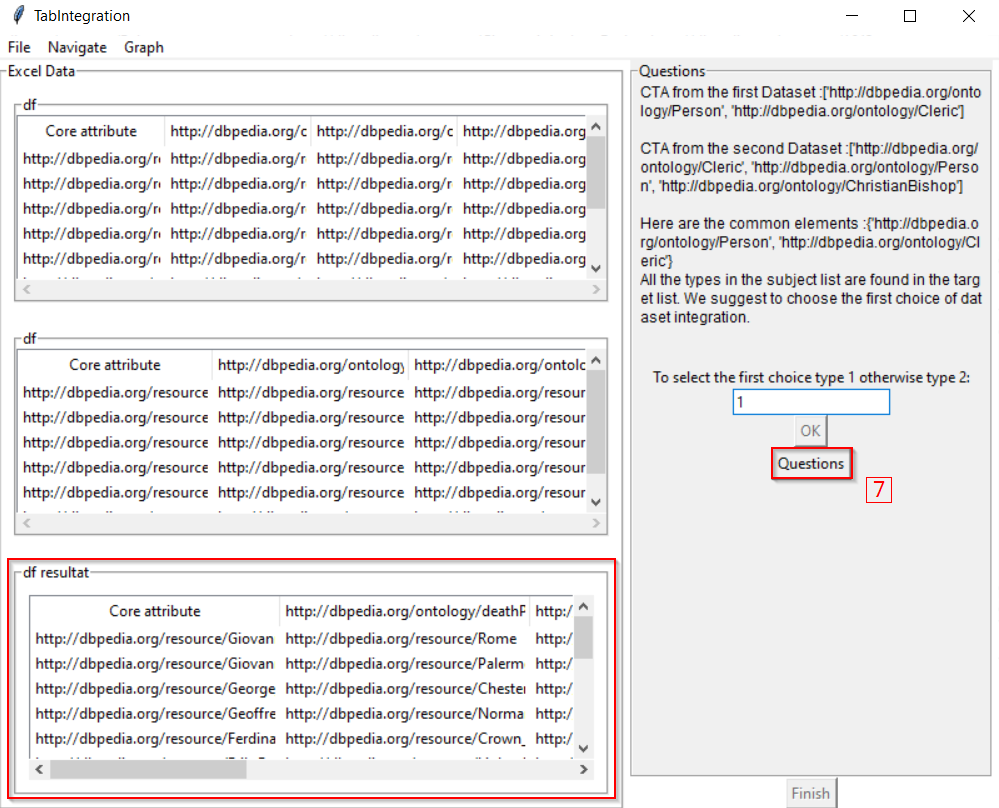
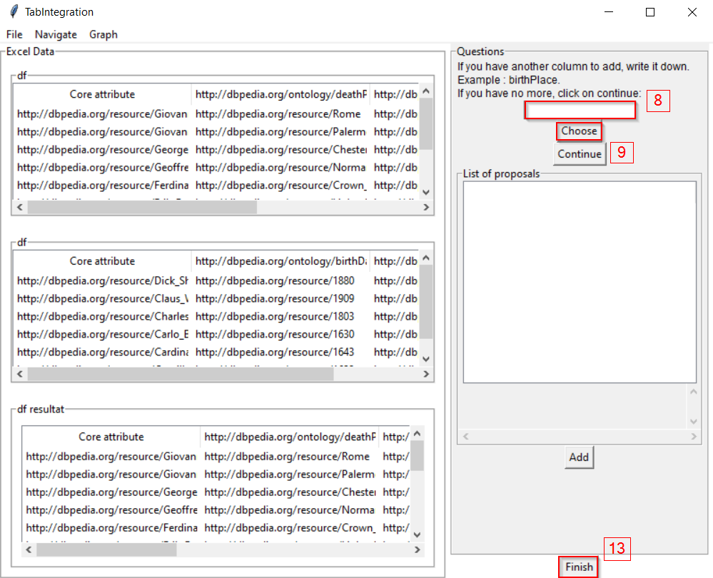
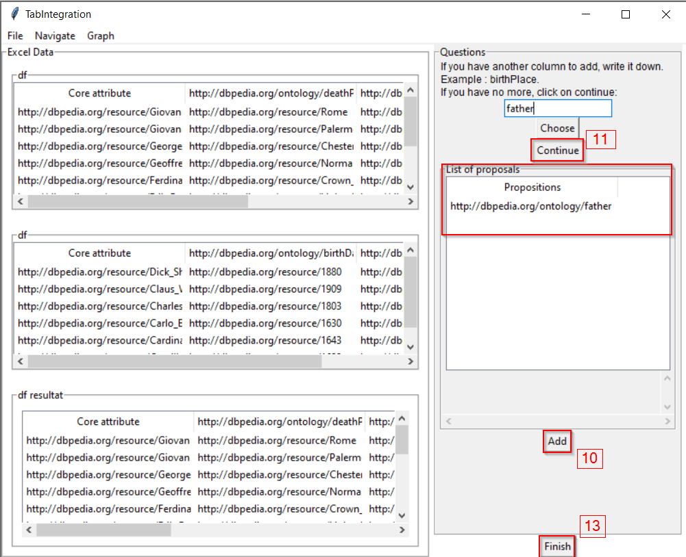
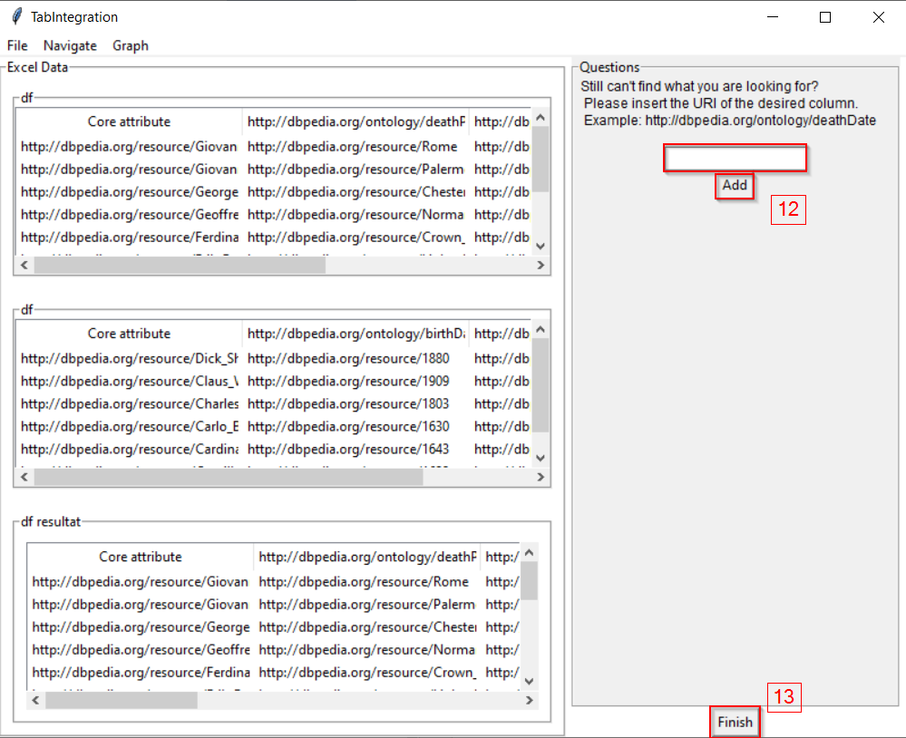

<h1>TabIntegration </h1>

<h2>Description </h2>

TODO 
TODO
 
 

 
<h2>Installation and Run</h2>

<h4> Requirements : </h4>
<ul>
    <li> <a href="https://www.python.org/">Python 3.9</a></li>
    <li> <a href="https://www.mozilla.org/firefox/download/">Firefox </a></li>
</ul>

<h4> Steps : </h4>
<ol>
    <li> Download zip of application of branch master </li>
    <li> Extract zip and launch cmd on its location </li>
    <li> Launch : </li>
    <pre>python sc_install.py </pre>
     To install all python librairies
    <pre>python main.py</pre>
     To launch application

</ol>

 
<h2>Demo</h2>

You can find some files on .idea/files

Load Files

Load URI

Select your choice (1 or 2)

Show next question

Add one or more columns or finish if you want

Add one or more URIs or finish if you want

Click on core attribute to URI to change first column header

Now, you can display graph of results or save your results in file (csv or xlsx)

