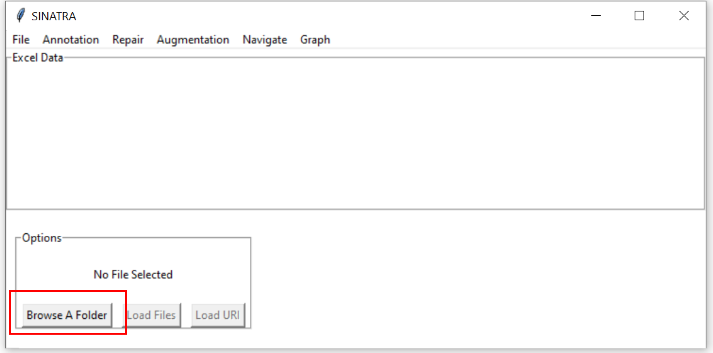

<h1>SDA: Semantic Data  Repair and Augmentation </h1>
For more details about the results of evalution are here: https://github.com/123rabida123/Datasets-and-Results-of-evaluation-SDA

 
 

 
<h2>Installation and Run</h2>

<h4> Requirements : </h4>
<ul>
    <li> <a href="https://www.python.org/">Python 3.9</a></li>
    <li> <a href="https://www.mozilla.org/firefox/download/">Firefox </a></li>
</ul>

<h4> Steps : </h4>
<ol>
    <li> Download zip of application of branch master </li>
    <li> Extract zip and launch cmd on its location </li>
    <li> Install all python librairies : </li>
    <pre>python sc_install.py </pre>
    <li> Launch application : </li>
    <pre>python main.py</pre>
</ol>

 
<h2>Demo</h2>

 You can find some files on .idea/files 

 Detection of the Subject Column 

 
<h2>Logs</h2>
